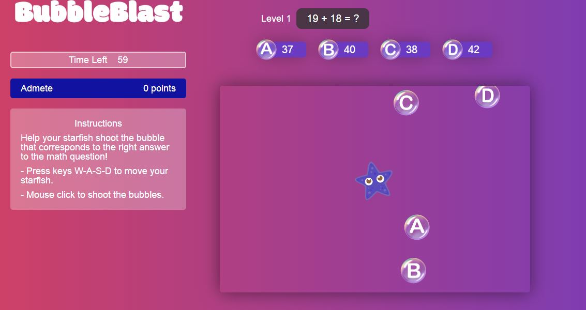

# BubbleBlast

*Can you find the correct answers before other players? Have fun racing against the clock and learning about a variety of differrent educational topics while playing this fun interactive game.*

[Play the game](http://bubbleblast.herokuapp.com/#/)


## Background and Overview
  Bubble Blast is a multiple choice question and answer game that allows players to learn about a vieriety of different topics.

* Can play 1 player or multi-player up to 10 players
* Players can seamlessly play Bubble Blast across devices ranging from desktop, to tablet, to mobile due to the responsive application.

## Functionality and MVP
* Pages 

  1. Leaderboard is on entry page waiting to start with other players is on entry page
  2. Question page pops up
  3. The actual game page
  4. Final score page with percentage and data visualization

* Topics 

  1. Math - starting with this one
  2. Geography - bonus
  3. Coding Quesitons - bonus
  4. Vocabulary - bonus
  5. Mandarin - bonus
  
* Game Logic 

  * You can play by yourself
  * You can play up to 10 players
  * Infinite amount of time but the longer you take the less points you get
  * Every question is a new level and the questions get harder each level, and the speed of the moving multiple choice
  questions gets faster
  * When you shoot the bullet has to go off the page before you can shoot again
  * Multi Player
    * Once right answer is taken, it moves to the next question
    * Scores will go on leaderboard
    * Everyone ahs to press a button and once presed the game will start
    * When you shoot the bullet has to go off the page before you can shoot again

* Responsive, has to work on mobile, desktop, tablet

## Technologies and Technical Challenges

* Websockets, using socket.io 
* Canvas
* MERN
* Responsive

### Socket.io incorporated with Redux
```javascript
let socket;
export const connect = (username) => {
  socket.emit("connectGame", { username: username, error: 0 });
};

export const setUpConnectGameListener = (cb) => {
  socket = new io();
  socket.on("connectGame", (msg) => {
    cb(msg);
  });
};

export const setUpGamePausedListener = (cb) => {
  socket.on("gamePaused", msg => {
    cb(msg);
  });
};

export const RECEIVE_GAME_PAUSED_SOCKET_MESSAGE = "RECEIVE_GAME_PAUSED_SOCKET_MESSAGE";

const receiveGamePausedMessage = message => {
  return {
    type: RECEIVE_GAME_PAUSED_SOCKET_MESSAGE,
    message
  };
};

export const connectGame = (username) => {
  GameUtils.connect(username);
};
```

### Native HTML5 Canvas with React
```javascript
class GameView extends React.Component {
   render(){
        if(this.state.ctx){
            this.start()
        }
        return(
            <div>
                <canvas id="game-canvas" width={width} height={height} >

                </canvas>
            </div>
        )
    }

}
```

### MongoDB and Express

```javascript
const express = require("express");
const app = express();
const mongoose = require("mongoose");
const db = require("./config/keys").mongoURI;
const http = require('http').Server(app);
const io = require('socket.io')(http);
const SocketGameHandler = require('./socketGameHandler');

if (process.env.NODE_ENV === 'production') {
  app.use(express.static('frontend/build'));
  app.get('/', (req, res) => {
    res.sendFile(path.resolve(__dirname, 'frontend', 'build', 'index.html'));
  });
}

mongoose.connect(db, {
  useNewUrlParser: true
}).then(() => {
  console.log("Connected to mongoDB");
}).catch((err) => {
  console.log(err);
});

app.use("/api/questions", questions);

const port = process.env.PORT || 5000;

let socketHandler = new SocketGameHandler(io);


http.listen(port, function () {
  console.log('listening on *:' + port);
});


```
## Group Members and Work Breakdown
 
 * Kristina
   * HTML/CSS for page 1, 2, 4
   * Data visualization and statistics for page 4
   * Seed data for math questions, difficulty 1 -10
   * Bonus
     * Seed data for vocabulary
     * Seed data for coding questions with Phillip

 * Erin
   * Make game responsive for desktop, tablet, and mobile
   * Page 3, with canvas
   * Scoring logic
   * Bonus
     * Seed data for geography
     * Seed data for mandarin with Phillip

 * Phillip
   * Game logic
   * Back End
   * Bonus
     * Seed data for coding questions with Kristina
     * Seed data for mandarin questions with Erin
 
 * Day Breakdown
  
   1. Day 1
      * Fnish project proposal
      * Create back end 
      * Start HTML/CSS
      * Research responsiveness
   2. Day 2
      * Work on backend game logic
      * Finish HTML/CSS
      * Research canvas/Start working on canvas
   3. Day 3
      * Work on backend/front-end game logic
      * Start seed database gathering
      * Continue working on canvas
   4. Day 4 
      * Work on backend/front-end game logic
      * Continue seed database gathering
      * Continue working on canvas
      * Implement responsiveness
   5. Day 5
      * Finish backend/front-end game logic
      * Continue seed database gathering
      * Continue canvas work
      * Finish responsive work
   6. Day 6
      * Continue seed database gathering
      * Continue canvas work
   7. Day 7
      * Finish seed database gathering
      * Finish canvas work
 

